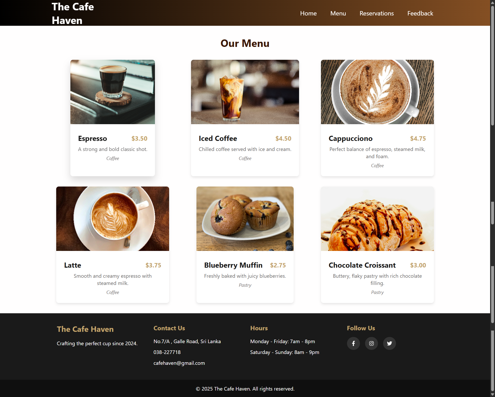
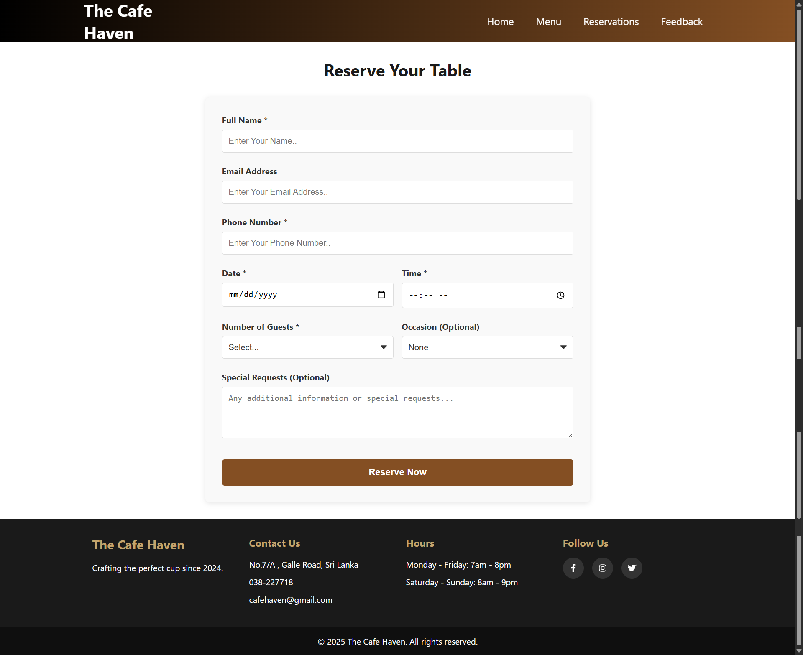
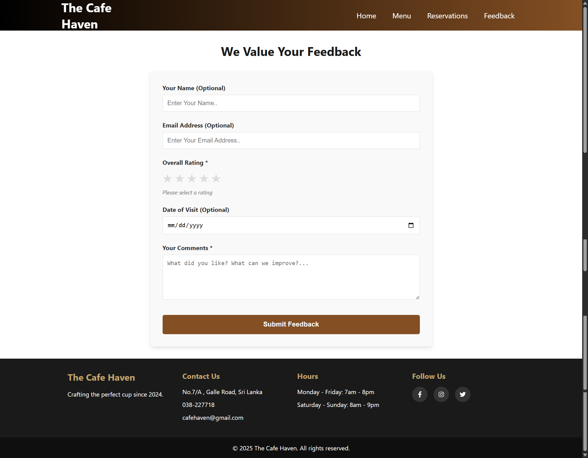

# ☕ The Brew Haven - Full-Stack Coffee Shop App

A complete full-stack web application for a fictional coffee shop, built with Java Spring Boot and React. Users can browse the menu, reserve tables, and submit feedback.


## ✨ Features

- **Menu Page**: Browse coffee and pastry items with images and prices
- **Online Reservations**: Form to book a table with date/time selection
- **Feedback System**: Submit reviews with a 5-star rating system
- **Responsive Design**: Works seamlessly on desktop and mobile devices

## 🛠️ Tech Stack

### Frontend
- **React** 18 - UI framework
- **React Router** - Navigation
- **Axios** - HTTP client for API calls
- **CSS3** - Styling with Flexbox and Grid

### Backend
- **Java 17** - Programming language
- **Spring Boot** 3 - Application framework
- **Spring Data JPA** - Database ORM
- **MySQL** 8 - Relational database
- **Maven** - Dependency management

## 📁 Project Structure

```
coffee-shop-app/
├── coffee-shop-frontend/     # React application
│   ├── public/
│   ├── src/
│   │   ├── components/       # Reusable UI components
│   │   ├── pages/           # Main application pages
│   │   ├── services/        # API service configuration
│   │   └── data/            # Static data files
│   └── package.json
└── coffee-shop-backend/      # Spring Boot application
    ├── src/
    │   └── main/
    │       ├── java/
    │       │   └── com/
    │       │       └── coffeeshop/
    │       │           ├── controller/    # REST controllers
    │       │           ├── entity/        # Data models
    │       │           ├── repository/    # JPA repositories
    │       │           └── config/        # Configuration classes
    │       └── resources/
    │           └── application.properties # Database configuration
    └── pom.xml
```

## 🚀 Getting Started

### Prerequisites
- Node.js 16+ 
- Java 17
- MySQL 8.0+

### Backend Setup
1. Navigate to the backend directory:
   ```bash
   cd coffee-shop-backend
   ```
2. Configure your MySQL database in `src/main/resources/application.properties`
3. Run the application:
   ```bash
   ./mvnw spring-boot:run
   ```
   The backend will start on `http://localhost:8084`

### Frontend Setup
1. Navigate to the frontend directory:
   ```bash
   cd coffee-shop-frontend
   ```
2. Install dependencies:
   ```bash
   npm install
   ```
3. Start the development server:
   ```bash
   npm start
   ```
   The frontend will start on `http://localhost:3000`

## 📝 API Endpoints

| Method | Endpoint | Description |
|--------|----------|-------------|
| GET | `/api/menu` | Get all menu items |
| POST | `/api/menu` | Create new menu item |
| POST | `/api/reservations` | Create new reservation |
| POST | `/api/feedback` | Submit feedback |

## 📸 Screenshots

| Home Page | Menu Page |
|:---:|:---:|
|  |  |

| Reservations Page | Feedback Page |
|:---:|:---:|
|  |  |

## 🎯 Future Enhancements

- User authentication and profiles
- Admin dashboard for managing reservations
- Order tracking system
- Payment integration
- Email notifications


